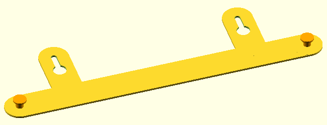
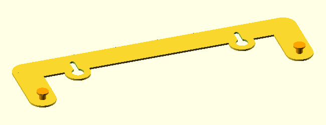
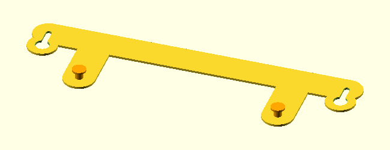
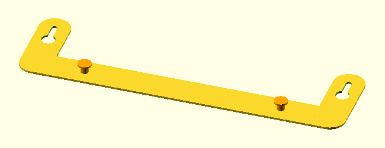
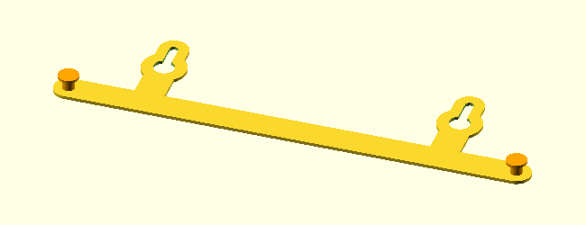
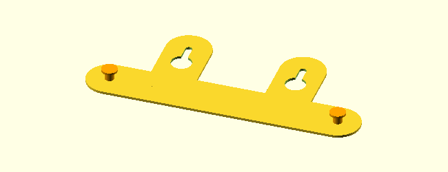
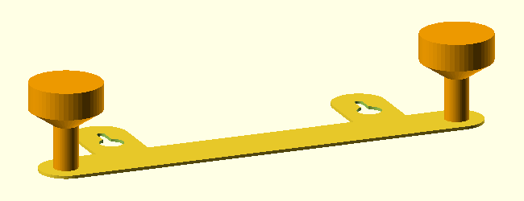

# Wall Mount Mate

*This repository contains a model that can be printed with a 3D printer. Create the .stl files with [OpenScad](https://openscad.org/).*

An adapter that can be used when replacing a wall-mounted device and you need a different nail spacing.

I just replaced my internet modem and although the new device is slightly smaller, the nail spacing for wall mounting is much larger.

Adjust the variables at the top of the script to suit your needs.

There are two designs (set design=1 or design=2):

Design 1:

This is the first approach which works well, most of the bracket is hidden behind the modem.

Design 2:

When I noticed that the bracket was covering part of the modem's ventilation slots, I changed the design accordingly.

Here some more examples created by just changing the parameters:

The last eyecatcher is for fun of course.